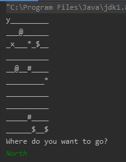

# Simple Java console game :video_game:

## Intro
This project is about simple java console game, which consists of a player, map and several map objects, all represented as a text. This project was created only for educational purposes to practise knowledge gained in courses and workshops.

## Technologies :hammer_and_pick:

Java version 8 or higher

## Launch :electric_plug:

 1. Press the Fork to copy this repository to your profile

 2. Clone this project to your local environment by command 
 git clone https://github.com/nuraiza/simple-java-console-game.git
 or simply download the project from Download section

 3. Open the project with Intellij Idea or any other Java IDE (ex Eclipse)
 4. Run the application
## How to play? :video_game:

 - A game world is 10x10 grid map.
 - X is the player, he can move in 4 directions. To move him please type into console North/South/East/West and Enter.
 - @ is a weapon, player can collect them by going to their location.
 - Be careful, there are some bombs on the map, they are represented as * .
 - Player can get additional health by collecting #.
 - Enemy is patrolling his area, he is represented as Y and is constantly moving up and down. However, it is dangerous to approach to him without any weapon, he can take your health.
 - Time to collect all money - $, and win the game!
## Have fun :D
This project can be easily extended. Many new ideas, functionalities are only welcome! If you want to contribute to this project I am waiting for your pull request :)

## License
Distributed under the MIT License. See LICENSE.txt for more information.

## Contact
 <a href="<https://www.linkedin.com/in/nuraiza/>"></a>

